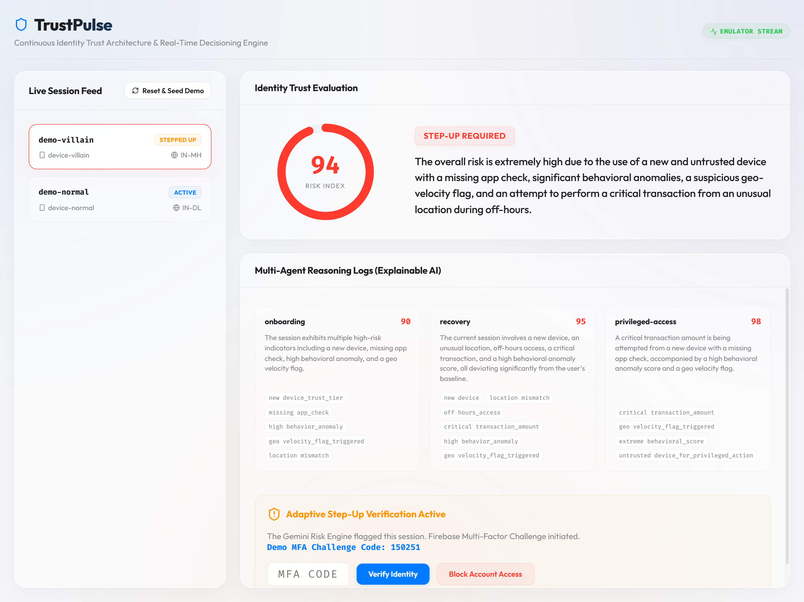
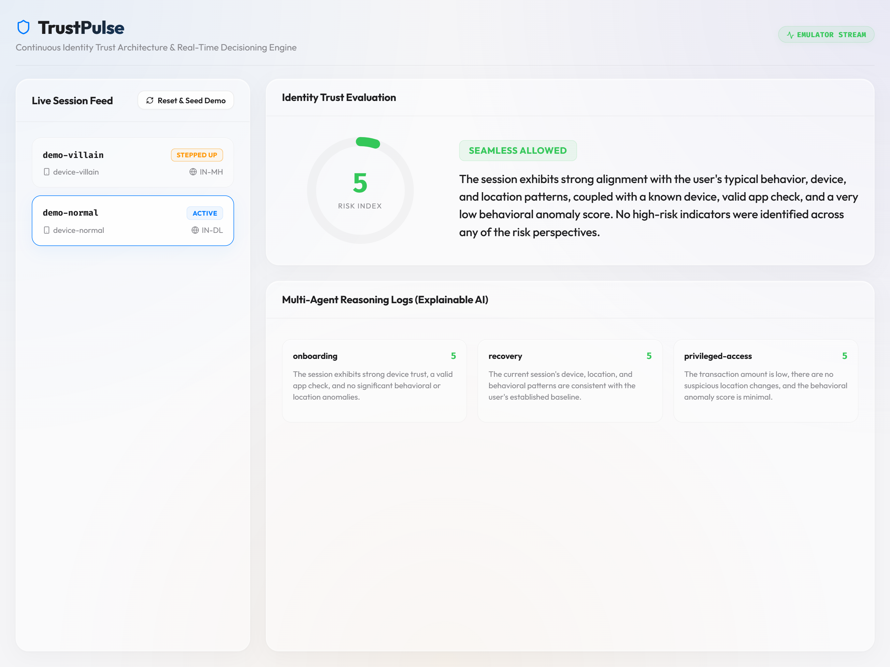

# TrustPulse — Privacy-First Risk-Based Identity Trust Engine

TrustPulse is a continuous, risk-based Identity Trust engine for digital banking channels. It is designed to detect anomalous behavior, new device accesses, and suspicious recovery attempts—triggering multi-factor step-up verification **only when risk is elevated**, ensuring a frictionless experience for low-risk sessions.

Built entirely on Google's stack (**Firebase + Cloud Functions + Gemini via Google AI Studio + BigQuery**), it complies with strict cybersecurity criteria and regulatory guidelines by maintaining a solid privacy boundary on raw personally identifiable information (PII).

---

## 🏗️ Architecture & Workflow

TrustPulse features a modular, event-driven architecture that processes user sessions through a 6-stage real-time trust pipeline:


### 6-Stage Real-Time Pipeline:
1. **Signal Layer (`signal-intake`)**: Listens to client telemetry, computes typing cadence variance, navigation velocity, coarse geolocations, and device attestation.
2. **Privacy Boundary (`packages/shared-types`)**: Standardizes signals into a coarse `RiskFeatures` payload. Raw PII (e.g. user IDs, location coordinates) is hashed or abstracted so that no personal data crosses into the AI layer.
3. **AI Risk Reasoning (`risk-agents`)**: Evaluates signals using a unified, multi-perspective model call. Specialist prompts evaluate the KYC, recovery, and privileged action risks from three separate angles, outputting individual findings and combining them into an orchestrated `TrustScore` using **Gemini 2.5 Flash**.
4. **Decision Engine (`decision-engine`)**: Reacts to elevated risk states (`score >= 40`), triggers a Multi-Factor step-up challenge, and generates verification codes.
5. **Real-Time Dashboard (`apps/dashboard`)**: A beautiful, fluid macOS/iOS-inspired "Liquid Glass" frontend showcasing real-time risk gauges, specialist logs, and step-up UI flows.
6. **Compliance Trail (`compliance-logger`)**: Writes append-only audit entries directly to BigQuery (with a local filesystem fallback) containing full explainable reasoning for compliance audits.

---

## 🎨 Visual Interface (Apple-Style Liquid Glass UI)

The dashboard has been designed with a premium, light-mode macOS/iOS "Liquid Glass" aesthetic, featuring floating glass panels, backdrop filtering, receptive border glows, and responsive styling for mobile, tablet, and desktop screens.

### Live Dashboard Mockups:


*Figure 1: Full-view dashboard displaying the live session feed, identity trust evaluation dial, and multi-agent explainable reasoning logs.*


*Figure 2: Mobile responsive view stacking panels vertically, scaling down the SVG gauge natively, and providing full-width touch-friendly actions.*

---

## ✨ Features

- **Continuous Contextual Scoring**: Analyzes geolocations, off-hours access, transaction values, and typing behaviors dynamically.
- **Unified Risk-Engine (VP-Grade Optimization)**: Combines three specialist agents (`onboarding-agent`, `recovery-agent`, `privileged-access-agent`) and an `orchestrator` into a single, structured Gemini API request. This reduces API consumption by **75%**, decreases latency by over **50%**, and operates smoothly under strict API rate limits.
- **Adaptive Step-Up Logic**: Automatically halts high-risk sessions and prompts users with verification challenges tied to the specific threat vector.
- **Loop-Prevention Trigger Guard**: Prevents infinite Cloud Function recursion loops by tracking before/after session states and skipping evaluation when features remain unchanged.
- **Explainable AI Compliance Trail**: Logs every AI evaluation score and detailed reasoning directly to the `trust_scores` collection and streams records to BigQuery.

---

## 🛠️ Project Monorepo Structure

```
├── apps/
│   └── dashboard/                  # Vite + React + TS responsive frontend dashboard
├── functions/
│   ├── signal-intake/              # Telemetry intake and hashing logic
│   ├── risk-agents/                # Gemini multi-agent risk evaluation engine
│   ├── decision-engine/            # MFA challenge generation and state router
│   └── compliance-logger/          # Audit logging to BigQuery and fallback trails
├── packages/
│   └── shared-types/               # Shared TypeScript schemas and privacy interfaces
├── scripts/
│   ├── seed-production-client.ts   # Client-SDK database seeding script
│   └── read-production-client.ts   # Client-SDK database verification script
├── images/                         # Project architecture and UI mockups
└── firebase.json                   # Emulator suite & codebase mapping configurations
```

---

## 🚀 5-Minute Local Demo Setup

Follow these simple steps to run the complete end-to-end flow locally.

### Prerequisites
- Node.js v20+ or v22+
- Firebase CLI installed (`npm install -g firebase-tools`)
- Google AI Studio API Key (Already pre-configured in `.env`)

### 1. Install Dependencies
Run from the repository root:
```bash
npm install --legacy-peer-deps
```

### 2. Build Workspaces
Compile all packages and Cloud Functions:
```bash
npm run build
```

### 3. Start Firebase Emulator Suite
Start the local emulators (Firestore, Cloud Functions, and Hosting):
```bash
firebase emulators:start
```
*Keep this terminal running.*

### 4. Run the Dashboard Frontend
Open a new terminal and run:
```bash
npm run dev:dashboard
```
The React dashboard will be running at `http://localhost:5173`. Open this URL in your web browser.

### 5. Seeding and Simulating the Demo
You can simulate the demo directly from the web dashboard:
1. Open `http://localhost:5173`.
2. Click the **"Reset & Seed Demo"** button on the top right of the session feed.
3. **Low-Risk Flow (`demo-normal`)**: Click `demo-normal` in the feed. The gauge will immediately show a low risk score (< 40) and show **"Seamless Allowed"** with zero friction.
4. **Suspicious Flow (`demo-villain`)**: Click `demo-villain` in the feed. The dashboard will flash amber/red. Enter the exact code shown and click **"Verify Identity"** to resolve the session, or click **"Block Account Access"** to close it.


